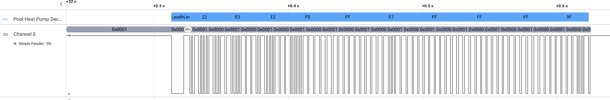

  # Heat Pump Decoder
  
This is an Extension for the Saleae Logic 2 software for Saleae Logic Analyzers. This decodes signals in the heat pump format.

To use this, you'll need to install it to your instance of Logic 2. Then, capture a signal from your remote. Next, go to Analyzers, and add a new analyzer of the Simple Parallel variety. This is a serial signal, but using the Parallel was the best way I could find to get frames that correspond to individual bits. Select the channel to analyze, and then go down to Clock and select the same signal line. Finally, select dual edge as clock state. Once you apply this analyzer, you should now have each of your bits segmented out.

Now, with that foundational analyzer in place, we can apply the heat pump decoder. Add a second analyzer of the Heat Pump Decoder type. For your input analyzer, select the Simple Parallel that we just placed. That should give you something a little like my example here of a captured data frame:

