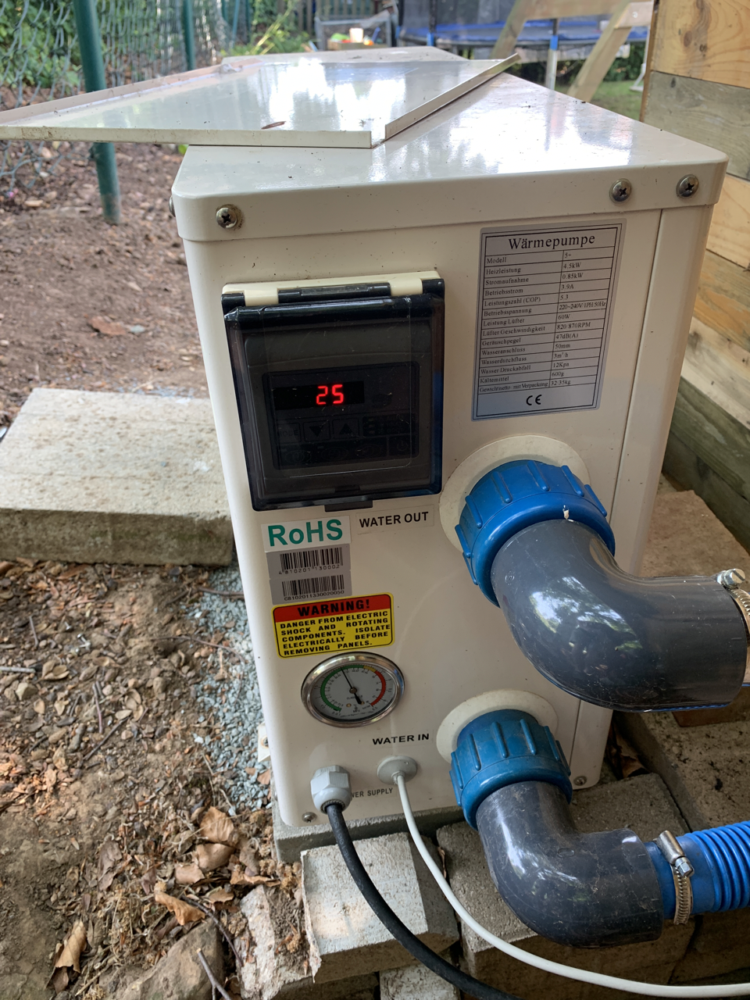
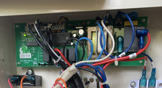
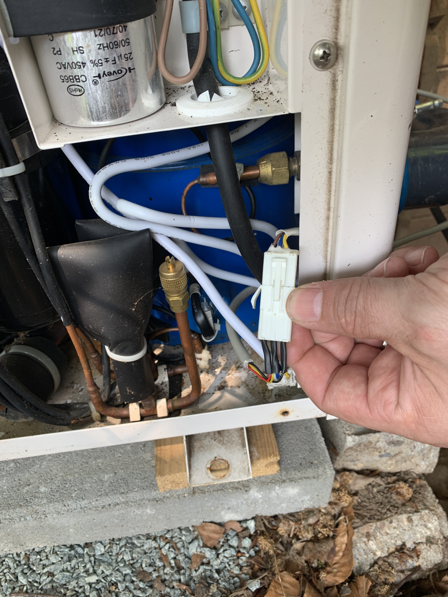
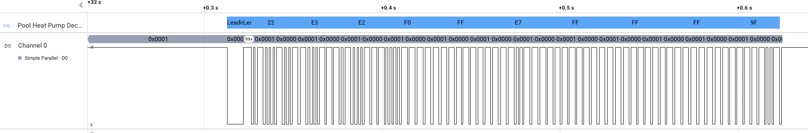
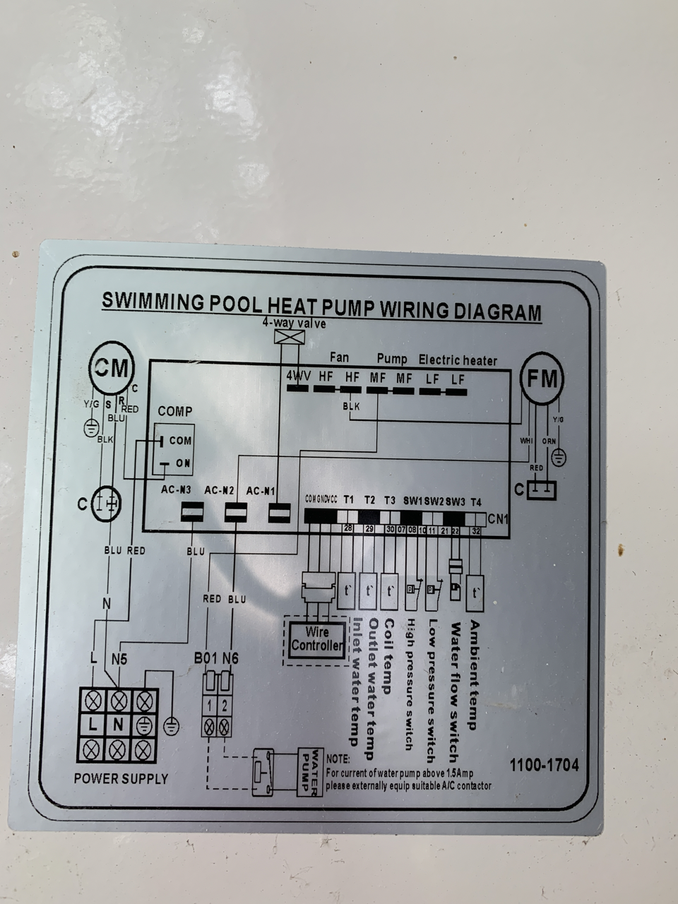
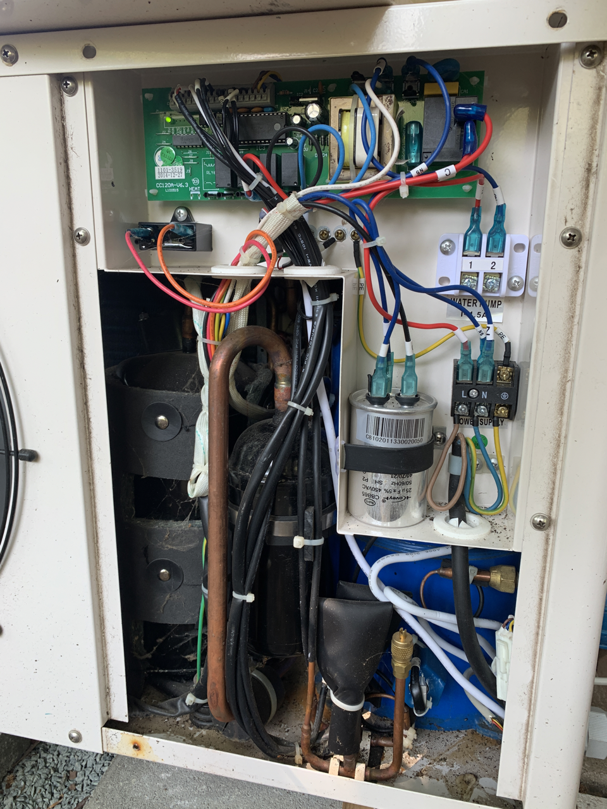

# ESP8268 Pool Heater MQTT bridge

This project connects the pool heat pump which use a controller board with label CC120A V6.3 via mqtt in my home automation environment.



BOARD LABEL: CC120A V6.3  



# Connection

You have to connect terminal connector ( 3 wires) from the CC120A Board to your ESP8266 by using a 5v  bidirectional level shifter. The 5v <-> 3.3v level shifter is mandatory because the esp8266 is not 5V tolerant, and the heatpump controller is not working with 3.3v.
!!!attention!!!, the powerline supplies 18V, so you need a step down converter to realize 5v. 


| Connector | Color | Description |
|-----------|-------|-------------|
|GND        | Yellow| Ground      |
|DAT        | Blue  | 4.2V / 5V, RX/TC Line
|VCC        | Brown | 18V!  |



TODO: more infos and maybe  pictures of the schemantic and connections


# Background & Reversing
I have decoded the data using a picoscope oscilloscope und a salea logic analyzer clone. You can find my tools and more informations in the folder "investigation". 
The decoded signal has some similarities th the nec ir protocol. There is a special startsequence and the bits are encoded by pulse length modulation:



Current state of reversing the serial protocol:  
Click: [Protocol and more](./investigation/protocol.md)


# MQTT
Click: [MQTT Description](./mqtt.md)


# Node-Red
Node-Red example to expose the mqtt interface of the heat pump as homekit-service to control the pool heat pump via an apple device and the home app.

```json
[{"id":"d1eb2eb66caa1862","type":"homekit-service","z":"5b25b43cda4fb3fe","isParent":true,"hostType":"0","bridge":"409001a1.3e7a78","accessoryId":"","parentService":"","name":"Pool","serviceName":"Thermostat","topic":"","filter":false,"manufacturer":"NRCHKB","model":"1.5.0","serialNo":"Default Serial Number","firmwareRev":"1.5.0","hardwareRev":"1.5.0","softwareRev":"1.5.0","cameraConfigVideoProcessor":"ffmpeg","cameraConfigSource":"","cameraConfigStillImageSource":"","cameraConfigMaxStreams":2,"cameraConfigMaxWidth":1280,"cameraConfigMaxHeight":720,"cameraConfigMaxFPS":10,"cameraConfigMaxBitrate":300,"cameraConfigVideoCodec":"libx264","cameraConfigAudioCodec":"libfdk_aac","cameraConfigAudio":false,"cameraConfigPacketSize":1316,"cameraConfigVerticalFlip":false,"cameraConfigHorizontalFlip":false,"cameraConfigMapVideo":"0:0","cameraConfigMapAudio":"0:1","cameraConfigVideoFilter":"scale=1280:720","cameraConfigAdditionalCommandLine":"-tune zerolatency","cameraConfigDebug":false,"cameraConfigSnapshotOutput":"disabled","cameraConfigInterfaceName":"","characteristicProperties":"{\"TargetHeatingCoolingState\":{\"validValues\":[0,1]},\"CurrentHeatingCoolingState\":{\"validValues\":[0,1]}}","waitForSetupMsg":false,"outputs":2,"x":830,"y":720,"wires":[["62263d416c7eba55"],[]]},{"id":"3f112b1122c39ef0","type":"mqtt in","z":"5b25b43cda4fb3fe","name":"","topic":"PoolHeater/get/current","qos":"2","datatype":"auto-detect","broker":"c525d14c5c4c5e1d","nl":false,"rap":true,"rh":0,"inputs":0,"x":400,"y":720,"wires":[["e1daa1e621b44f76","6e198c1249e9a2ab","50487ecedd5a6332","ae311ee3c31a48e4"]]},{"id":"e1daa1e621b44f76","type":"function","z":"5b25b43cda4fb3fe","name":"Übersetze von MQTT","func":"\n/*\nTargetHeatingCoolingState:\n    Off\t0\n    Heat\t1\n    Cool\t2\n    Auto\t3\n\nCurrentHeatingCoolingState:\n    Off\t    0\n    Heat\t1\n    Cool\t2\n\n */\nvar currentHeatingState = 0;\nif (msg.payload.power ){\n    if (msg.payload.mode == 'cool'){\n        currentHeatingState = 2;\n    }else {\n        currentHeatingState = 1;\n    }\n}\n\nvar targetHeatingState = 0;\nif (msg.payload.power) {\n    if (msg.payload.mode == 'cool') {\n        targetHeatingState = 2;\n    }\n    else if (msg.payload.mode = 'auto') {\n        targetHeatingState = 1;\n    } \n    else {\n        targetHeatingState = 1;\n    }\n}\n\nmsg.payload = { \n    CurrentTemperature: msg.payload.temp_in,  \n    TargetTemperature: msg.payload.temp_target, \n    CurrentHeatingCoolingState: currentHeatingState, \n    TargetHeatingCoolingState: targetHeatingState \n}\n\nreturn msg;","outputs":1,"noerr":0,"initialize":"","finalize":"","libs":[],"x":640,"y":720,"wires":[["d1eb2eb66caa1862"]]},{"id":"eee0cc78758b70e5","type":"function","z":"5b25b43cda4fb3fe","name":"Übersetze nach MQTT","func":"//{\"TargetHeatingCoolingState\":0}\n//{\"TargetTemperature\":31}\n\nif (\"TargetHeatingCoolingState\" in msg.payload){\n    return { topic: 'PoolHeater/set/power', payload: msg.payload.TargetHeatingCoolingState!=0?1:0 }\n}\nif (\"TargetTemperature\" in msg.payload) {\n    return { topic: 'PoolHeater/set/target', payload: Math.floor(msg.payload.TargetTemperature) }\n}\n\nreturn;","outputs":1,"noerr":0,"initialize":"","finalize":"","libs":[],"x":1340,"y":720,"wires":[["7eaaa775d2e16d30"]]},{"id":"62263d416c7eba55","type":"switch","z":"5b25b43cda4fb3fe","name":"Filtere nur, wenn durch Nutzer ausgelöst","property":"hap.session","propertyType":"msg","rules":[{"t":"nempty"}],"checkall":"true","repair":false,"outputs":1,"x":1060,"y":720,"wires":[["eee0cc78758b70e5"]]},{"id":"50487ecedd5a6332","type":"debug","z":"5b25b43cda4fb3fe","name":"debug 12","active":true,"tosidebar":true,"console":false,"tostatus":false,"complete":"false","statusVal":"","statusType":"auto","x":840,"y":920,"wires":[]},{"id":"7eaaa775d2e16d30","type":"mqtt out","z":"5b25b43cda4fb3fe","name":"Send To Heat Pump","topic":"","qos":"","retain":"","respTopic":"","contentType":"","userProps":"","correl":"","expiry":"","broker":"c525d14c5c4c5e1d","x":1560,"y":720,"wires":[]},{"id":"6e198c1249e9a2ab","type":"trigger","z":"5b25b43cda4fb3fe","name":"","op1":"","op2":"{\"CurrentHeatingCoolingState\":0,\"TargetHeatingCoolingState\":0}","op1type":"nul","op2type":"json","duration":"120","extend":false,"overrideDelay":false,"units":"s","reset":"","bytopic":"all","topic":"topic","outputs":1,"x":710,"y":520,"wires":[["d1eb2eb66caa1862","996359c66cb78328"]]},{"id":"f27703e8c5e92a0b","type":"function","z":"5b25b43cda4fb3fe","name":"setup time","func":"const secondsSinceEpoch = Math.round(Date.now() / 1000);\nmsg.payload = secondsSinceEpoch;\nmsg.topic = \"PoolHeater/set/timestamp\"\n\nreturn msg;","outputs":1,"noerr":0,"initialize":"","finalize":"","libs":[],"x":1350,"y":860,"wires":[["7eaaa775d2e16d30"]]},{"id":"721fee2013fb8660","type":"inject","z":"5b25b43cda4fb3fe","name":"","props":[{"p":"payload"},{"p":"topic","vt":"str"}],"repeat":"","crontab":"","once":false,"onceDelay":0.1,"topic":"","payload":"","payloadType":"date","x":1160,"y":860,"wires":[["f27703e8c5e92a0b"]]},{"id":"0b836576a82836a0","type":"ui_gauge","z":"5b25b43cda4fb3fe","name":"","group":"30ed43281cf2e5ee","order":8,"width":0,"height":0,"gtype":"gage","title":"Temperatur Pool","label":"C","format":"{{value}}","min":0,"max":"40","colors":["#00b500","#e6e600","#ca3838"],"seg1":"","seg2":"","diff":false,"className":"","x":560,"y":960,"wires":[]},{"id":"b346079202e303c5","type":"ui_gauge","z":"5b25b43cda4fb3fe","name":"","group":"30ed43281cf2e5ee","order":8,"width":0,"height":0,"gtype":"gage","title":"Temperatur Wärmepumpe","label":"C","format":"{{value}}","min":0,"max":"40","colors":["#00b500","#e6e600","#ca3838"],"seg1":"","seg2":"","diff":false,"className":"","x":590,"y":1000,"wires":[]},{"id":"ae311ee3c31a48e4","type":"function","z":"5b25b43cda4fb3fe","name":"function 6","func":"return [\n    { topic: \"temp_in\", payload: msg.payload.temp_in},\n    { topic: \"temp_out\", payload: msg.payload.temp_out},\n    { topic: \"temp_target\", payload: msg.payload.temp_target },\n    { topic: \"power\", payload: msg.payload.power },\n    { topic: \"mode\", payload: msg.payload.mode },\n    { topic: \"wifi_rssi\", payload: msg.payload.wifi_rssi },\n    { topic: \"timestamp\", payload: new Date(1000 *msg.payload.timestamp)} \n]","outputs":7,"noerr":0,"initialize":"","finalize":"","libs":[],"x":320,"y":980,"wires":[["0b836576a82836a0"],["b346079202e303c5"],["221abb1511213622"],[],[],[],["6512ee30ed6f4ad4"]]},{"id":"221abb1511213622","type":"ui_text","z":"5b25b43cda4fb3fe","group":"30ed43281cf2e5ee","order":8,"width":0,"height":0,"name":"","label":"Target","format":"{{msg.payload}}","layout":"row-spread","className":"","x":530,"y":1040,"wires":[]},{"id":"6512ee30ed6f4ad4","type":"ui_text","z":"5b25b43cda4fb3fe","group":"30ed43281cf2e5ee","order":8,"width":0,"height":0,"name":"","label":"Timestamp","format":"{{msg.payload}}","layout":"row-spread","className":"","x":550,"y":1080,"wires":[]},{"id":"409001a1.3e7a78","type":"homekit-bridge","bridgeName":"Demo 1","pinCode":"153-10-538","port":"","allowInsecureRequest":false,"manufacturer":"NRCHKB","model":"Demo","serialNo":"1.1.2","firmwareRev":"","hardwareRev":"","softwareRev":"","customMdnsConfig":false,"mdnsMulticast":true,"mdnsInterface":"","mdnsPort":"","mdnsIp":"","mdnsTtl":"","mdnsLoopback":true,"mdnsReuseAddr":true,"allowMessagePassthrough":true},{"id":"c525d14c5c4c5e1d","type":"mqtt-broker","name":"RybyNas MQTT","broker":"192.168.178.56","port":"1883","clientid":"","autoConnect":true,"usetls":false,"protocolVersion":"4","keepalive":"60","cleansession":true,"birthTopic":"","birthQos":"0","birthPayload":"","birthMsg":{},"closeTopic":"","closeQos":"0","closePayload":"","closeMsg":{},"willTopic":"","willQos":"0","willPayload":"","willMsg":{},"userProps":"","sessionExpiry":""},{"id":"30ed43281cf2e5ee","type":"ui_group","name":"Pool","tab":"4e6c796e2fe774e5","order":1,"disp":true,"width":"6","collapse":false,"className":""},{"id":"4e6c796e2fe774e5","type":"ui_tab","name":"Garten","icon":"dashboard","order":3,"disabled":false,"hidden":false}]
```


# Pictures





